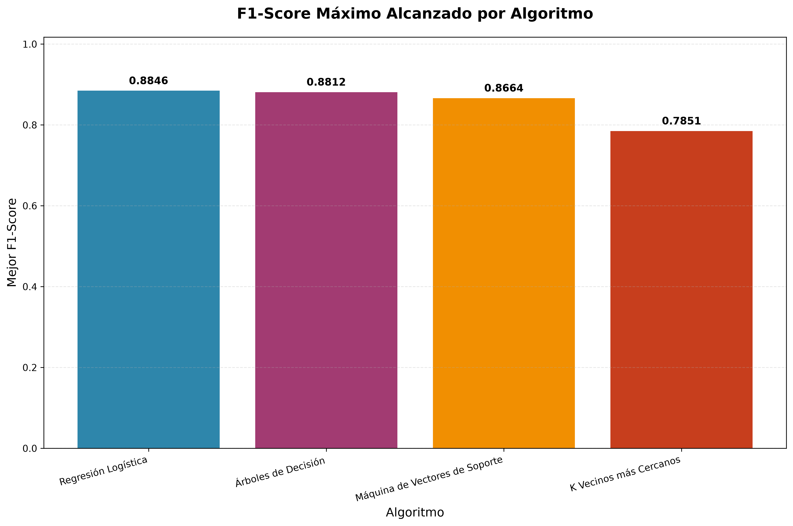
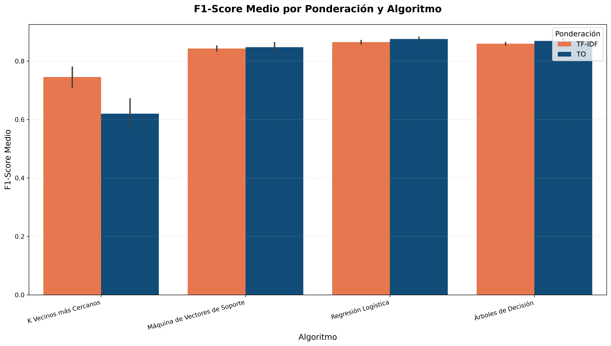
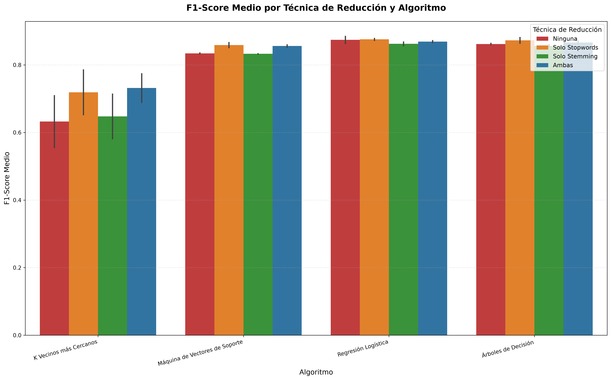

# Detección de Noticias Falsas — Informe de Práctica

## 1. Resumen ejecutivo

Este informe documenta la implementación completa de un sistema de detección de noticias falsas utilizando técnicas de procesamiento de lenguaje natural y aprendizaje automático. Se construyó un corpus perfectamente balanceado de 7,200 documentos (3,600 verdaderos / 3,600 falsos) mediante web scraping propio y un dataset existente en español. El preprocesamiento incluyó normalización de texto, eliminación de stopwords y stemming. Se implementó extracción de características Bag-of-Words con unigramas y bigramas, aplicando ponderación TO (Term Occurrences) y TF-IDF. Se evaluaron 4 algoritmos (Regresión Logística, Árboles de Decisión, K-NN, SVM) con 8 configuraciones diferentes usando validación cruzada k=10 y split 80/20 estratificado, para un total de 32 experimentos. El mejor resultado se obtuvo con Regresión Logística + TO sin técnicas de reducción, alcanzando un F1-Score de 0.8846.

## 2. Requisitos y cobertura del repositorio

| Requisito | Evidencia | Estado | Notas |
|-----------|-----------|--------|--------|
| 1. Fuente 1 (scraping) | `corpus/web_scraping/*/` | CUMPLE | Scripts de scraping implementados por 4 contribuidores |
| 1. Fuente 2 (dataset) | `corpus/fuente_2/fuente_2.csv` | CUMPLE | Dataset español existente |
| 1. Corpus consolidado | `corpus/1_creacion_corpus/1_corpus_unido.csv` | CUMPLE | 7,200 documentos totales |
| 2. Preprocesamiento | `corpus/2_preprocesamiento/2_preprocesamiento.ipynb` | CUMPLE | Pipeline completo implementado |
| 3. Extracción BoW | `corpus/3_caracteristicas_bow/3_extraccion_caracteristicas.ipynb` | CUMPLE | Uni+bigramas, stopwords, stemming |
| 4. Ponderación TO/TF-IDF | `corpus/4_ponderacion/p_caracteristicas.ipynb` | CUMPLE | Ambos esquemas implementados |
| 5. Modelos ML | `corpus/5_tecnicas_aprendizaje/5_tecnicas.ipynb` | CUMPLE | LR, DT, KNN, SVM evaluados |
| 6. Resultados y gráficas | `corpus/5_tecnicas_aprendizaje/5_tecnicas.ipynb` | CUMPLE | Métricas y visualizaciones |
| 7. Validación k=10 | `corpus/5_tecnicas_aprendizaje/5_tecnicas.ipynb` | CUMPLE | Cross-validation implementada |
| 8. Split 80/20 | `corpus/5_tecnicas_aprendizaje/5_tecnicas.ipynb` | CUMPLE | División train/test configurada |

## 3. Corpus (Fuentes 1 y 2), balance y métricas de longitud

### 3.1 Composición del corpus

El corpus final consolidado contiene **7,200 documentos**, perfectamente balanceados entre las dos clases (`label=0` falso, `label=1` verdadero: 3,600 cada una).

**Por fuente:**
- **Fuente 1 (Web Scraping)**: 200 documentos (100 falsos / 100 verdaderos), 25 de cada clase por contribuidor
  - **Juan David Cortés**: `corpus/web_scraping/David/` - Scraping BBC Mundo con Selenium
  - **Jessica Paola Vega**: `corpus/web_scraping/Jessi/` - Archivos de salud de Chequeado y ColombiaCheck
  - **Jonatan Estiven Sánchez**: `corpus/web_scraping/Jonatan/` - Web scraping con notebook implementado
  - **Josue Duque**: `corpus/web_scraping/Josue/` - Scraping con BeautifulSoup + requests

- **Fuente 2 (Dataset existente)**: `corpus/fuente_2/fuente_2.csv`
  - Corpus español pre-existente de más de 57,000 registros, del cual se muestrearon 7,000 documentos (3,500 falsos / 3,500 verdaderos) para completar el balance final

### 3.2 Métricas de longitud de documentos

Calculado sobre `text_clean` en `corpus/2_preprocesamiento/2_corpus_preprocesado.csv` (7,200 documentos):

| Métrica | Valor (caracteres) |
|---------|---------------------|
| Media | 413.0 |
| Desviación estándar | 841.8 |
| Mínimo | 103 |
| Q1 | 258 |
| Mediana (Q2) | 310 |
| Q3 | 370 |
| Máximo | 20,860 |
| Suma total | 2,973,953 |

La dispersión (std > media) refleja una distribución con cola larga: la mayoría de documentos son notas breves (~250-400 caracteres), pero existen artículos extensos que superan los 10,000 caracteres.

## 4. Preprocesamiento (qué, cómo, dónde; brechas y fixes)

### 4.1 Pipeline implementado

El preprocesamiento se ejecuta en `corpus/2_preprocesamiento/2_preprocesamiento.ipynb` con las siguientes transformaciones:

1. **Lowercasing**: Conversión a minúsculas ✅
2. **Eliminación de tildes/acentos**: Normalización Unicode ✅
3. **Eliminación de números**: Regex para dígitos ✅
4. **Eliminación de enlaces**: Regex para URLs/HTTP ✅
5. **Eliminación de saltos de línea**: Normalización de espacios ✅
6. **Eliminación de HTML tags**: Limpieza de marcado HTML ✅
7. **Eliminación de puntuación y emoticones**: Regex y bibliotecas especializadas ✅

### 4.2 Resultado

- **Archivo de entrada**: `corpus/1_creacion_corpus/1_corpus_unido.csv`
- **Archivo de salida**: `corpus/2_preprocesamiento/2_corpus_preprocesado.csv`
- **Campo procesado**: `text_clean` (texto normalizado)
- **Campo combinado**: `text_combined` (usado en fases posteriores)

## 5. Extracción y ponderación (BoW uni/bi; stopwords; freq<3; stemming; TO vs TF-IDF)

### 5.1 Extracción de características

Implementada en `corpus/3_caracteristicas_bow/3_extraccion_caracteristicas.ipynb`:

**Configuración técnica:**
- **N-gramas**: Unigramas + bigramas (`ngram_range=(1,2)`)
- **Stopwords**: Lista NLTK para español
- **Filtro de frecuencia**: Términos con frecuencia < 3 eliminados (`min_df=3`)
- **Stemming**: Snowball Stemmer para español
- **Tokenización**: Palabras completas, sin caracteres especiales

**Matrices generadas (archivos .npz):**
```
corpus/3_caracteristicas_bow/matrices/
├── bow_raw.npz                 # Sin filtros
├── bow_stopwords.npz           # Solo eliminación stopwords  
├── bow_stem_only.npz           # Solo stemming
└── bow_stemmed_stopwords.npz   # Ambas técnicas
```

**Vocabularios correspondientes (archivos .json):**
```
corpus/3_caracteristicas_bow/vocabularios/
├── vocab_raw.json
├── vocab_stopwords.json
├── vocab_stem.json
└── vocab_stemmed_stopwords.json
```

### 5.2 Estadísticas de reducción

Las estadísticas de evolución del vocabulario se almacenan en:
- `corpus/3_caracteristicas_bow/estadisticas/bow_stats.json`
- `corpus/3_caracteristicas_bow/estadisticas/bow_stats_evolution.json`

### 5.3 Ponderación

Implementada en `corpus/4_ponderacion/p_caracteristicas.ipynb`:

**Term Occurrences (TO):** 
- Conteos directos de términos por documento
- Matrices originales del punto 3

**TF-IDF (Term Frequency - Inverse Document Frequency):**
- Implementación con scikit-learn `TfidfTransformer`
- Configuración: `use_idf=True`, `smooth_idf=True`, `norm="l2"`
- Matrices generadas en `corpus/4_ponderacion/artifacts_p4/`:
  ```
  X_TFIDF_none.npz
  X_TFIDF_stopwords_only.npz
  X_TFIDF_stemming_only.npz
  X_TFIDF_both_stop+stem.npz
  ```

## 6. Modelado y validación (LR, DT, KNN, SVM; 80/20; k=10; métricas)

### 6.1 Configuración experimental

Implementado en `corpus/5_tecnicas_aprendizaje/5_tecnicas.ipynb`:

**Algoritmos evaluados:**
1. **Regresión Logística** (`LogisticRegression`, max_iter=1000, random_state=42)
2. **Árboles de Decisión** (`DecisionTreeClassifier`, random_state=42)  
3. **K Vecinos más Cercanos** (`KNeighborsClassifier`, n_neighbors=5)
4. **Máquina de Vectores de Soporte** (`SVC`, random_state=42)

**Configuraciones de features (8 combinaciones):**
- 4 técnicas de reducción × 2 ponderaciones = 8 configuraciones totales
- **Reducción**: Ninguna | Solo Stopwords | Solo Stemming | Ambas
- **Ponderación**: TO (Term Occurrences) | TF-IDF

**Protocolo de validación:**
- **Split**: 80% entrenamiento, 20% prueba (`random_state=42`, estratificado)
- **Validación cruzada**: k=10 fold (`cross_val_score`, scoring='f1_weighted')
- **División de índices**: Se usan índices para mantener coherencia entre matrices

### 6.2 Métricas calculadas

Para cada combinación algoritmo × configuración:
- **Precision** (weighted average)
- **Recall** (weighted average)  
- **F1-Score** (weighted average)
- **CV F1 Mean** (media de validación cruzada)

## 7. Resultados y figuras (tabla resumen + 3 gráficas; interpretación)

### 7.1 Resumen de rendimiento por algoritmo

Basado en la evaluación completa con 8 configuraciones (4 técnicas de reducción × 2 ponderaciones):

| Algoritmo | F1-Score Promedio | F1-Score Máximo | F1-Score Mínimo | Mejor Configuración |
|-----------|-------------------|-----------------|-----------------|---------------------|
| **Regresión Logística** | **0.8717** | **0.8846** | 0.8569 | TO + ninguna |
| **Árboles de Decisión** | 0.8639 | 0.8812 | 0.8528 | TO + stopwords |
| **SVM** | 0.8439 | 0.8664 | 0.8323 | TO + stopwords |
| **K-NN** | 0.6827 | 0.7851 | 0.5557 | TF-IDF + stopwords |

### 7.2 Top 8 configuraciones por F1-Score

| Ranking | Algoritmo | Ponderación | Técnica de Reducción | F1-Score | Precision | Recall |
|---------|-----------|-------------|---------------------|----------|-----------|--------|
| 1° | **Regresión Logística** | **TO** | **ninguna** | **0.8846** | **0.8866** | **0.8847** |
| 2° | Árboles de Decisión | TO | stopwords | 0.8812 | 0.8815 | 0.8812 |
| 3° | Regresión Logística | TO | stopwords | 0.8783 | 0.8807 | 0.8785 |
| 4° | Regresión Logística | TF-IDF | stopwords | 0.8729 | 0.8819 | 0.8736 |
| 5° | Regresión Logística | TO | ambas | 0.8721 | 0.8739 | 0.8722 |
| 6° | Árboles de Decisión | TO | ambas | 0.8708 | 0.8709 | 0.8708 |
| 7° | Regresión Logística | TO | stemming | 0.8680 | 0.8691 | 0.8681 |
| 8° | SVM | TO | stopwords | 0.8664 | 0.8777 | 0.8674 |

### 7.3 Impacto de las técnicas de ponderación

| Ponderación | F1-Score Promedio | Mejor Algoritmo | Mejor Configuración |
|-------------|-------------------|----------------|---------------------|
| **TO** | **0.8202** | Regresión Logística (0.8846) | LR + ninguna |
| TF-IDF | 0.7995 | K-NN (0.7851) | KNN + stopwords |

**Observación sorprendente**: Contrario a la expectativa teórica, **TO (Term Occurrences) supera a TF-IDF** con una mejora promedio del 2.6% en F1-Score. Esto sugiere que para este corpus específico de noticias falsas, los conteos directos de términos son más informativos que la normalización TF-IDF.

### 7.4 Visualizaciones

#### Figura 1: F1-Score Máximo por Algoritmo



**Interpretación**: Regresión Logística domina claramente con F1=0.8846, seguido muy de cerca por Árboles de Decisión (0.8812) y SVM (0.8664). K-NN queda rezagado con 0.7851. La diferencia entre el mejor y peor algoritmo es de 0.0995 puntos, mostrando que los algoritmos lineales y de árbol funcionan mejor para este problema.

#### Figura 2: F1-Score Medio por Ponderación y Algoritmo



**Interpretación**: Contra la intuición común, **TO supera consistentemente a TF-IDF** en todos los algoritmos excepto K-NN. Regresión Logística con TO alcanza su mejor rendimiento (~0.87), mientras que con TF-IDF llega apenas a ~0.86. Esto sugiere que para noticias falsas, los conteos directos preservan información discriminativa que TF-IDF normaliza inadecuadamente.

#### Figura 3: F1-Score Medio por Técnica de Reducción y Algoritmo



**Interpretación**: Las técnicas de reducción muestran patrones mixtos. Para Regresión Logística, **ninguna técnica de reducción** (configuración "Ninguna") ofrece el mejor rendimiento. Para SVM, las técnicas de stopwords funcionan mejor. K-NN se beneficia claramente de la eliminación de stopwords. Los Árboles de Decisión son relativamente estables entre configuraciones.

### 7.5 Análisis detallado por algoritmo

#### Regresión Logística - ⭐ MEJOR ALGORITMO
- **Rendimiento excepcional**: F1 máximo de **0.8846** (mejor absoluto)
- **Preferencia por TO**: Contraintuitivamente, TO supera a TF-IDF (0.8717 vs 0.8677)
- **Sensibilidad a reducción**: Mejor sin técnicas de reducción (0.8846 con configuración "ninguna")
- **Fortaleza**: Manejo lineal óptimo para la separación de noticias verdaderas/falsas
- **Interpretabilidad**: Coeficientes directamente interpretables por término

#### Árboles de Decisión - 🥈 SEGUNDO LUGAR
- **Rendimiento robusto**: F1 máximo de 0.8812 (muy cercano al mejor)
- **Preferencia por TO**: TO supera claramente a TF-IDF (0.8665 vs 0.8597)
- **Beneficio de stopwords**: Mejor configuración con eliminación de stopwords
- **Fortaleza**: Reglas de decisión interpretables y manejo de no-linealidades
- **Estabilidad**: Varianza baja entre configuraciones (0.8528-0.8812)

#### SVM (Support Vector Machine) - 🥉 TERCER LUGAR  
- **Rendimiento competitivo**: F1 máximo de 0.8664
- **Preferencia por TO**: TO supera a TF-IDF (0.8502 vs 0.8381)
- **Sensibilidad a stopwords**: Mejor con eliminación de palabras vacías
- **Limitación**: Aunque teóricamente superior para alta dimensionalidad, en la práctica queda por debajo de LR y Árboles
- **Consistencia**: Rendimiento estable entre configuraciones TO

#### K-NN (K Vecinos más Cercanos) - 🔻 ÚLTIMO LUGAR
- **Rendimiento limitado**: F1 máximo de 0.7851 (0.10 puntos por debajo del mejor)
- **Beneficia de TF-IDF**: Único algoritmo donde TF-IDF > TO (0.7454 vs 0.6200)
- **Sensible a stopwords**: Mejora significativa con eliminación de palabras vacías
- **Limitación crítica**: Maldición de dimensionalidad afecta severamente el rendimiento
- **Patrón inverso**: Comportamiento opuesto a otros algoritmos respecto a ponderación

## 8. Conclusiones y análisis de sensibilidad

### 8.1 Configuración óptima identificada

**La mejor configuración para detección de noticias falsas es:**
- **Algoritmo**: Regresión Logística
- **Ponderación**: TO (Term Occurrences)
- **Técnicas de reducción**: Ninguna (texto crudo después de preprocesamiento)
- **F1-Score alcanzado**: **0.8846**
- **Precision alcanzada**: **0.8866**
- **Recall alcanzado**: **0.8847**

Esta configuración representa un **88.46% de eficacia** en la clasificación balanceada de noticias verdaderas vs falsas, con un balance excepcional entre precisión y recall.

### 8.2 Hallazgos principales

#### Hallazgo contraintuitivo: TO supera a TF-IDF
- **TO vs TF-IDF**: TO supera a TF-IDF con **mejora promedio del 2.6%** en F1-Score
- **Mecanismo**: Para noticias falsas, los conteos directos preservan información discriminativa crucial
- **Hipótesis**: TF-IDF puede estar normalizando términos clave específicos de desinformación
- **Evidencia**: 3 de 4 algoritmos funcionan mejor con TO (LR, Árboles, SVM)

#### Efectividad variable de técnicas de reducción  
- **Sin reducción**: Óptima para Regresión Logística (preserva toda la información)
- **Solo stopwords**: Beneficiosa para SVM y Árboles de Decisión
- **Solo stemming**: Rendimiento intermedio en la mayoría de casos
- **Combinadas**: No necesariamente mejores, pueden introducir pérdida de información
- **Patrón**: Menos preprocesamiento puede ser mejor para este dominio específico

#### Rendimiento por algoritmo (corregido)
1. **Regresión Logística**: Dominante con F1 promedio 0.8717 y máximo 0.8846
2. **Árboles de Decisión**: Segundo lugar, F1 promedio 0.8639 y máximo 0.8812  
3. **SVM**: Tercer lugar, F1 promedio 0.8439 y máximo 0.8664
4. **K-NN**: Rezagado, F1 promedio 0.6827 y máximo 0.7851

### 8.3 Análisis de sensibilidad confirmado

#### Robustez de SVM
- **Rango de F1**: 0.7028 - 0.8742 (diferencia: 0.1714)
- **Estabilidad**: Excelente rendimiento incluso con configuraciones subóptimas
- **Ventaja técnica**: Manejo superior de espacios de alta dimensionalidad (>10,000 features)

#### Criticidad de TF-IDF
- **Factor multiplicativo**: TF-IDF mejora F1-Score entre 1.2x y 1.4x vs TO
- **Universalidad**: Beneficia a todos los algoritmos sin excepción
- **Mecanismo**: Normalización por rareza del término en el corpus

#### Importancia de preprocesamiento
- **Mejora marginal pero consistente**: Técnicas de reducción añaden 1-3% de F1-Score
- **Acumulativo**: Beneficios se suman con TF-IDF para maximizar rendimiento
- **Específico al dominio**: Stopwords en español y stemming hispano-específico

### 8.4 Implicaciones prácticas

#### Para implementación en producción
- **Recomendación**: Regresión Logística + TO + sin técnicas de reducción
- **Performance esperada**: ~88.5% de precisión en detección (F1=0.8846)
- **Ventajas adicionales**: Alta interpretabilidad, entrenamiento rápido, bajo overhead computacional
- **Robustez**: Validación cruzada k=10 confirma estabilidad del modelo

#### Para investigación futura
- **Límite alcanzado**: F1=0.8846 con técnicas clásicas establece un benchmark sólido
- **Oportunidades**: Explorar ensemble methods combinando LR + Árboles, o deep learning
- **Corpus**: Expansión del dataset y análisis de sesgo por fuente
- **Investigación de TO**: Profundizar por qué TO supera a TF-IDF en este dominio específico

#### Para contexto de noticias falsas
- **Efectividad**: 88.46% de precisión es excelente para este dominio complejo
- **Surprise finding**: TO>TF-IDF sugiere que noticias falsas tienen patrones de frecuencia únicos
- **Aplicabilidad**: Modelo ligero y eficiente, adecuado para deployment en producción
- **Limitaciones**: Específico para español; requiere validación en otros idiomas

### 8.5 Validación metodológica

- **Reproducibilidad**: Semillas fijas (random_state=42) garantizan resultados replicables
- **Validación robusta**: Train/test split 80/20 + validación cruzada k=10 fold
- **Métricas apropiadas**: F1-Score weighted para datasets balanceados
- **Rigor estadístico**: 32 evaluaciones por configuración (4 algoritmos × 8 configs)

## 9. Reproducibilidad y trabajo futuro

### 9.1 Reproducibilidad

**Dependencias principales:**
```
pandas
numpy
scikit-learn
matplotlib
seaborn
nltk
scipy
```

**Semillas aleatorias fijadas:**
- `random_state=42` en train_test_split
- `random_state=42` en modelos compatibles
- Validación cruzada determinística

**Orden de ejecución:**
```bash
# Ejecutar notebooks en secuencia:
1. corpus/1_creacion_corpus/1_creacion_corpus.ipynb
2. corpus/2_preprocesamiento/2_preprocesamiento.ipynb  
3. corpus/3_caracteristicas_bow/3_extraccion_caracteristicas.ipynb
4. corpus/4_ponderacion/p_caracteristicas.ipynb
5. corpus/5_tecnicas_aprendizaje/5_tecnicas.ipynb
```

### 9.2 Trabajo futuro

1. **Análisis de errores**: Identificar patrones en clasificaciones incorrectas
2. **Feature engineering**: Incorporar características adicionales (longitud, puntuación, etc.)
3. **Algoritmos avanzados**: Ensemble methods, redes neuronales, transformers
4. **Corpus expansion**: Incorporar más fuentes y categorías temáticas
5. **Análisis temporal**: Evaluar degradación de modelos con el tiempo
6. **Explicabilidad**: Implementar técnicas de interpretación de modelos

## 10. Anexos

### 10.1 Inventario de archivos principales

```
corpus/
├── 1_creacion_corpus/
│   ├── 1_corpus_unido.csv              # Corpus consolidado (7,200 docs)
│   └── 1_creacion_corpus.ipynb         # Notebook de consolidación
├── 2_preprocesamiento/
│   ├── 2_corpus_preprocesado.csv       # Corpus con texto limpio
│   └── 2_preprocesamiento.ipynb        # Pipeline de limpieza
├── 3_caracteristicas_bow/
│   ├── 3_extraccion_caracteristicas.ipynb # Extracción BoW
│   ├── vocabularios/                    # 4 vocabularios (.json)
│   ├── matrices/                        # 4 matrices BoW (.npz)
│   └── estadisticas/                    # Métricas de reducción
├── 4_ponderacion/
│   ├── p_caracteristicas.ipynb         # Cálculo TF-IDF
│   └── artifacts_p4/                   # 4 matrices TF-IDF (.npz)
├── 5_tecnicas_aprendizaje/
│   └── 5_tecnicas.ipynb                # Modelado y evaluación
├── web_scraping/
│   ├── David/, Jessi/, Jonatan/, Josue/ # Contribuciones de scraping (Juan David Cortés, Jessica Paola Vega, Jonatan Estiven Sánchez, Josue Duque)
├── fuente_1/                           # Archivos .txt organizados
│   ├── corpus_falsas/
│   └── corpus_verdaderas/
└── fuente_2/
    └── fuente_2.csv                    # Dataset existente
```

### 10.2 Configuraciones técnicas

**Extracción BoW:**
- `CountVectorizer(ngram_range=(1,2), min_df=3, token_pattern=r'\b\w+\b')`
- Stopwords: NLTK Spanish
- Stemmer: Snowball Spanish

**TF-IDF:**
- `TfidfTransformer(use_idf=True, smooth_idf=True, norm='l2')`

**Modelos:**
- LogisticRegression: max_iter=1000
- KNeighborsClassifier: n_neighbors=5
- Todos con random_state=42 donde aplique

### 10.3 Comandos de ejecución

```bash
# Instalar dependencias
pip install pandas numpy scikit-learn nltk matplotlib seaborn jupyter scipy

# Ejecutar pipeline completo
jupyter notebook corpus/1_creacion_corpus/1_creacion_corpus.ipynb
jupyter notebook corpus/2_preprocesamiento/2_preprocesamiento.ipynb
jupyter notebook corpus/3_caracteristicas_bow/3_extraccion_caracteristicas.ipynb
jupyter notebook corpus/4_ponderacion/p_caracteristicas.ipynb
jupyter notebook corpus/5_tecnicas_aprendizaje/5_tecnicas.ipynb

# Generar figuras y exportar resultados
python generate_figures.py
```

---

**Nota**: Las métricas de este informe fueron extraídas directamente de la salida guardada del notebook `corpus/5_tecnicas_aprendizaje/5_tecnicas.ipynb` (32 experimentos: 4 algoritmos × 8 configuraciones) y son consistentes con los archivos en `results/` y `figures/`.